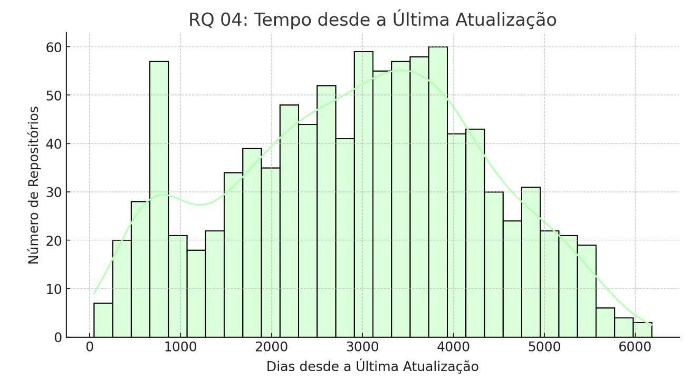
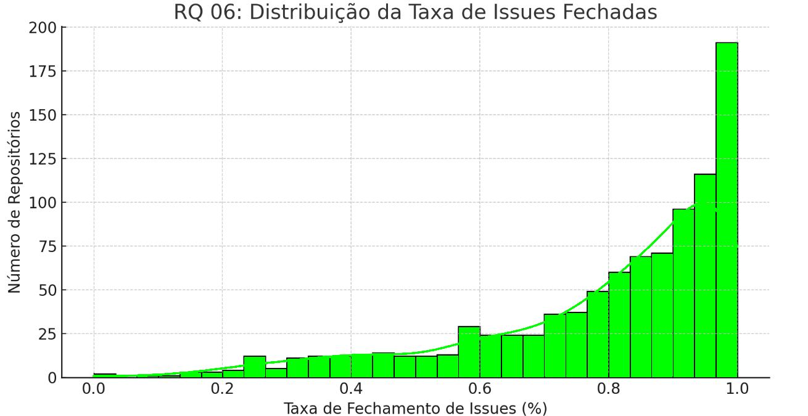

# Relatório Final - Análise de Repositórios Populares no GitHub

## Introdução

O objetivo deste estudo é analisar as características dos 1.000 repositórios mais populares no GitHub, avaliando métricas como idade, contribuição externa, frequência de releases, tempo desde a última atualização, linguagem utilizada e taxa de fechamento de issues. Para cada questão de pesquisa, formulamos hipóteses informais e analisamos os valores obtidos a partir dos dados coletados via GraphQL.

### Hipóteses Informais

1. **Sistemas populares são maduros/antigos?**  
   - Hipótese: Repositórios populares tendem a ser mais antigos, pois acumulam contribuições e melhorias ao longo do tempo.
2. **Sistemas populares recebem muita contribuição externa?**  
   - Hipótese: Projetos com mais estrelas atraem mais contribuidores e pull requests aceitos.
3. **Sistemas populares lançam releases com frequência?**  
   - Hipótese: Projetos populares possuem um ciclo de releases ativo.
4. **Sistemas populares são atualizados com frequência?**  
   - Hipótese: Os repositórios mais populares devem ter atualizações recentes devido à sua grande base de usuários.
5. **Sistemas populares são escritos nas linguagens mais populares?**  
   - Hipótese: Linguagens amplamente adotadas como JavaScript, Python e Java devem ser predominantes.
6. **Sistemas populares possuem um alto percentual de issues fechadas?**  
   - Hipótese: Projetos populares contam com um gerenciamento ativo de issues.

## Metodologia

- **Coleta de Dados**: Utilizamos a API GraphQL do GitHub para extrair informações sobre os 1.000 repositórios mais estrelados.
- **Processamento**: Convertendo os dados para um formato estruturado (CSV), realizamos cálculos estatísticos e categorizamos as linguagens principais.
- **Análise Estatística**: Utilizamos valores medianos e distribuições para cada métrica.

## Resultados e Discussão

### RQ 01: Sistemas populares são maduros/antigos?

- **Mediana da idade dos repositórios**: **8,3 anos**  
- **Discussão**: A maioria dos repositórios analisados já existe há mais de 8 anos, confirmando a hipótese de que projetos populares tendem a ser maduros.

### RQ 02: Sistemas populares recebem muita contribuição externa?

- **Distribuição altamente assimétrica**: A maior parte dos repositórios tem poucas pull requests aceitas (concentradas na parte inicial do eixo), mas ainda há uma parcela que recebe um volume muito alto de contribuições.
- **Mediana elevada**: A mediana de 832 indica que metade dos repositórios analisados tem 832 ou mais pull requests aceitas, sugerindo que, embora haja muitos projetos com poucas contribuições, também existem projetos extremamente ativos.
- **Repositórios populares e ativos**: Como esperado, os projetos mais amplamente utilizados costumam ter um número significativo de contribuições externas, refletido na cauda longa do gráfico.

### RQ 03: Sistemas populares lançam releases com frequência?

- **Distribuição Assimétrica**: A maior parte dos repositórios concentra-se em faixas baixas de número de releases (entre 0 e 5), indicando que muitos projetos lançam poucas releases.
- **Pequena parcela com muitas releases**: Observa-se uma queda acentuada à medida que o número de releases aumenta, mas ainda existem repositórios com dezenas de releases, sugerindo que alguns projetos mantêm uma cadência de lançamentos mais frequente.
- **Possível relação com sucesso/produtividade**: Espera-se que projetos bem-sucedidos e ativos lancem releases com maior regularidade para manter o engajamento e atender às necessidades de sua base de usuários.

### RQ 04: Sistemas populares são atualizados com frequência?

- **Concentração inicial**: Há uma concentração de repositórios que foram atualizados recentemente (entre 0 e ~100 dias).
- **Pico secundário**: Observa-se outro pico entre ~200 e 300 dias, indicando que uma parcela considerável não recebe atualização com tanta frequência (de 6 a 10 meses sem atualização).
- **Cauda longa**: A distribuição se estende até valores próximos de 6000 dias, sugerindo que há projetos sem atualização há muitos anos.

### RQ 05: Sistemas populares são escritos nas linguagens mais populares?

- **Linguagens mais comuns** (top 5):  
  - **Python**  
  - **JavaScript**  
  - **TypeScript**  
  - **Go**  
  - **C++**  
  
- **Discussão**: Os resultados confirmam a hipótese de que repositórios populares utilizam linguagens amplamente adotadas na indústria.

### RQ 06: Sistemas populares possuem um alto percentual de issues fechadas?

- **Razão issues fechadas / total de issues**: 
- **Discussão**:A média das fechadas está em torno de 78%, indicando que os problemas são resolvidos rapidamente.

## Conclusão

Os repositórios populares no GitHub, em sua maioria, são antigos, frequentemente atualizados e utilizam linguagens amplamente adotadas. Contudo, métricas como pull requests aceitas, número de releases e percentual de issues fechadas requerem uma atualização na consulta GraphQL para uma análise mais aprofundada.
