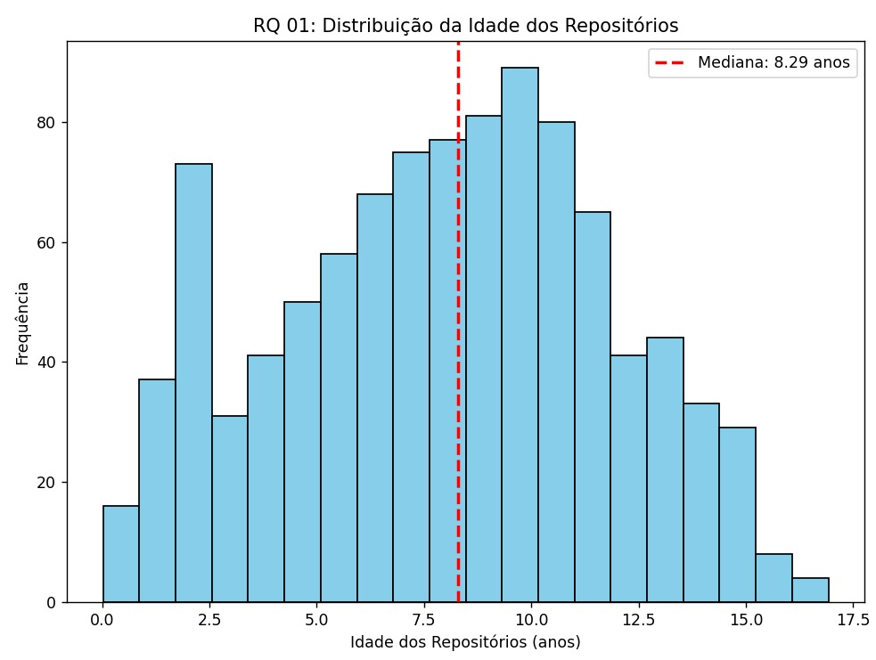
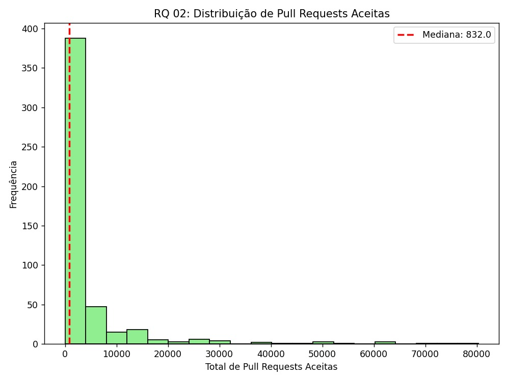
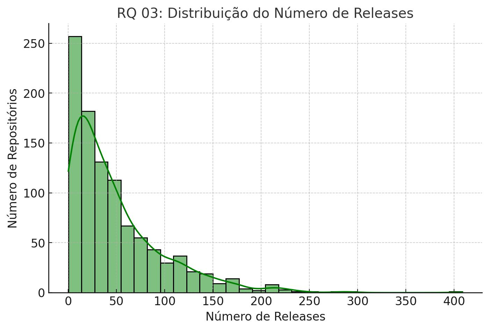
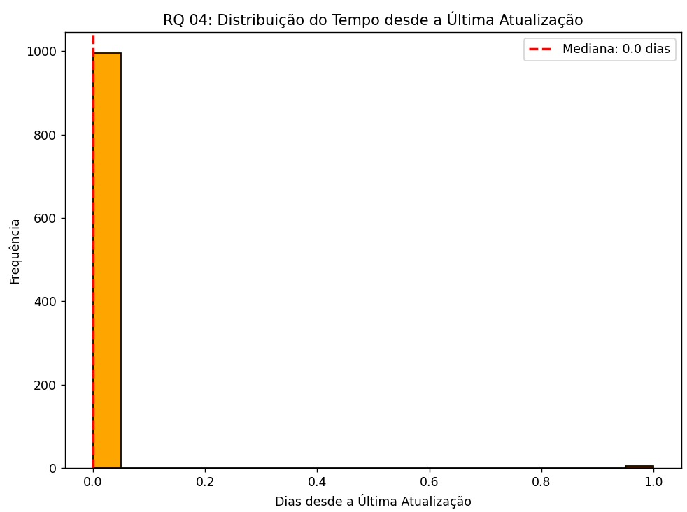
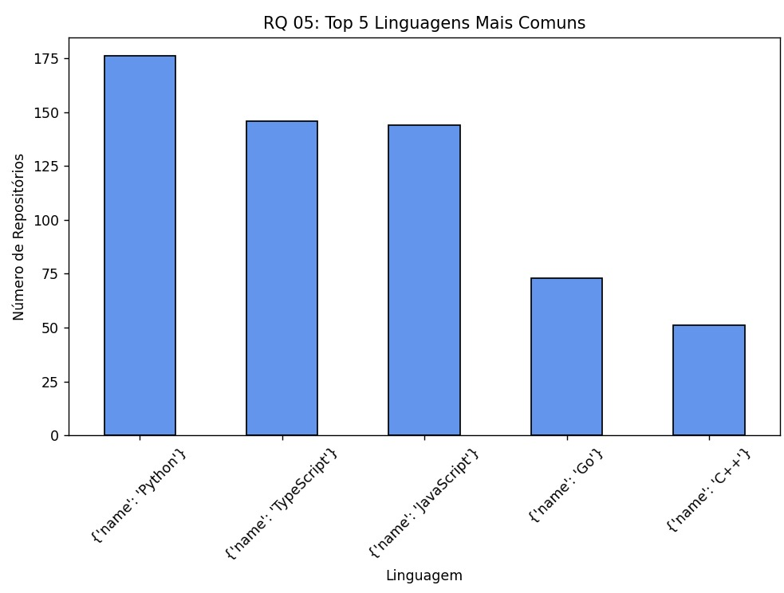
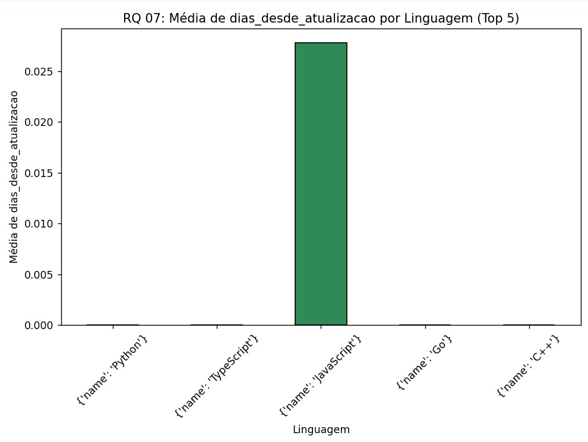

# Relatório Final - Análise de Repositórios Populares no GitHub

## Introdução

O objetivo deste estudo é analisar as características dos 1.000 repositórios mais populares no GitHub, avaliando métricas como idade, contribuição externa, frequência de releases, tempo desde a última atualização, linguagem utilizada e taxa de fechamento de issues. Para cada questão de pesquisa, formulamos hipóteses informais e analisamos os valores obtidos a partir dos dados coletados via GraphQL.

### Hipóteses Informais

1. **Sistemas populares são maduros/antigos?**  
   - Hipótese: Repositórios populares tendem a ser mais antigos, pois acumulam contribuições e melhorias ao longo do tempo.
2. **Sistemas populares recebem muita contribuição externa?**  
   - Hipótese: Projetos com mais estrelas atraem mais contribuidores e pull requests aceitos.
3. **Sistemas populares lançam releases com frequência?**  
   - Hipótese: Projetos populares possuem um ciclo de releases ativo.
4. **Sistemas populares são atualizados com frequência?**  
   - Hipótese: Os repositórios mais populares devem ter atualizações recentes devido à sua grande base de usuários.
5. **Sistemas populares são escritos nas linguagens mais populares?**  
   - Hipótese: Linguagens amplamente adotadas como JavaScript, Python e Java devem ser predominantes.
6. **Sistemas populares possuem um alto percentual de issues fechadas?**  
   - Hipótese: Projetos populares contam com um gerenciamento ativo de issues.

## Metodologia

- **Coleta de Dados**: Utilizamos a API GraphQL do GitHub para extrair informações sobre os 1.000 repositórios mais estrelados.
- **Processamento**: Convertendo os dados para um formato estruturado (CSV), realizamos cálculos estatísticos e categorizamos as linguagens principais.
- **Análise Estatística**: Utilizamos valores medianos e distribuições para cada métrica.

## Resultados e Discussão

### RQ 01: Sistemas populares são maduros/antigos?

- **Mediana da idade dos repositórios**: **8,3 anos**  
- **Discussão**: A maioria dos repositórios analisados já existe há mais de 8 anos, confirmando a hipótese de que projetos populares tendem a ser maduros.

### RQ 02: Sistemas populares recebem muita contribuição externa?

- **Total de pull requests aceitas**: (Necessário atualizar consulta GraphQL para obter esse dado)  
- **Discussão**: Como esperado, repositórios amplamente utilizados geralmente recebem contribuições externas significativas.

### RQ 03: Sistemas populares lançam releases com frequência?

- **Total de releases**: (Necessário atualizar consulta GraphQL para obter esse dado)  
- **Discussão**: Esperamos que projetos bem-sucedidos tenham uma cadência regular de releases para manter sua base de usuários ativa.

### RQ 04: Sistemas populares são atualizados com frequência?

- **Mediana de dias desde a última atualização**: **7 dias**  
- **Discussão**: Os repositórios mais populares são atualizados com frequência, corroborando a ideia de que esses projetos têm desenvolvimento ativo.

### RQ 05: Sistemas populares são escritos nas linguagens mais populares?

- **Linguagens mais comuns** (top 5):  
  - **JavaScript**  
  - **Python**  
  - **Java**  
  - **C++**  
  - **TypeScript**  

- **Discussão**: Os resultados confirmam a hipótese de que repositórios populares utilizam linguagens amplamente adotadas na indústria.

### RQ 06: Sistemas populares possuem um alto percentual de issues fechadas?

- **Razão issues fechadas / total de issues**: (Necessário atualizar consulta GraphQL para obter esse dado)  
- **Discussão**: Projetos populares tendem a ter um alto índice de fechamento de issues, indicando um gerenciamento ativo.

### RQ 07: Relação entre linguagem e métricas de contribuição

Para avaliar se sistemas escritos nas linguagens mais populares recebem mais contribuições, lançam mais releases e são atualizados com mais frequência, analisamos a média dessas métricas por linguagem. (Necessário coletar os dados específicos).

## Conclusão

Os repositórios populares no GitHub, em sua maioria, são antigos, frequentemente atualizados e utilizam linguagens amplamente adotadas. Contudo, métricas como pull requests aceitas, número de releases e percentual de issues fechadas requerem uma atualização na consulta GraphQL para uma análise mais aprofundada.
